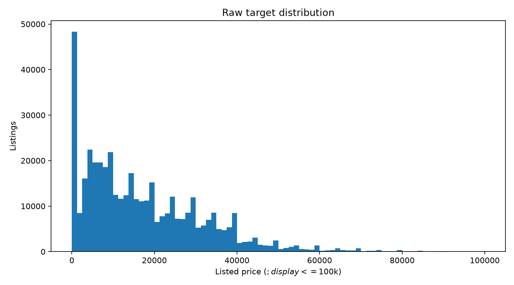
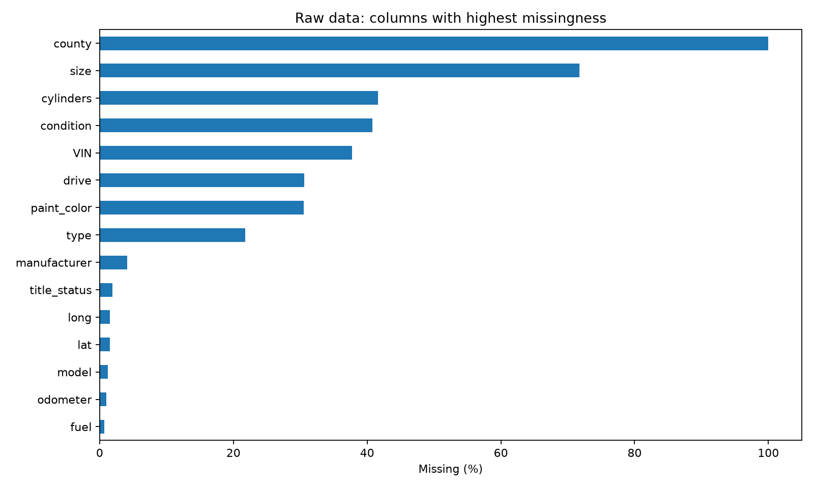
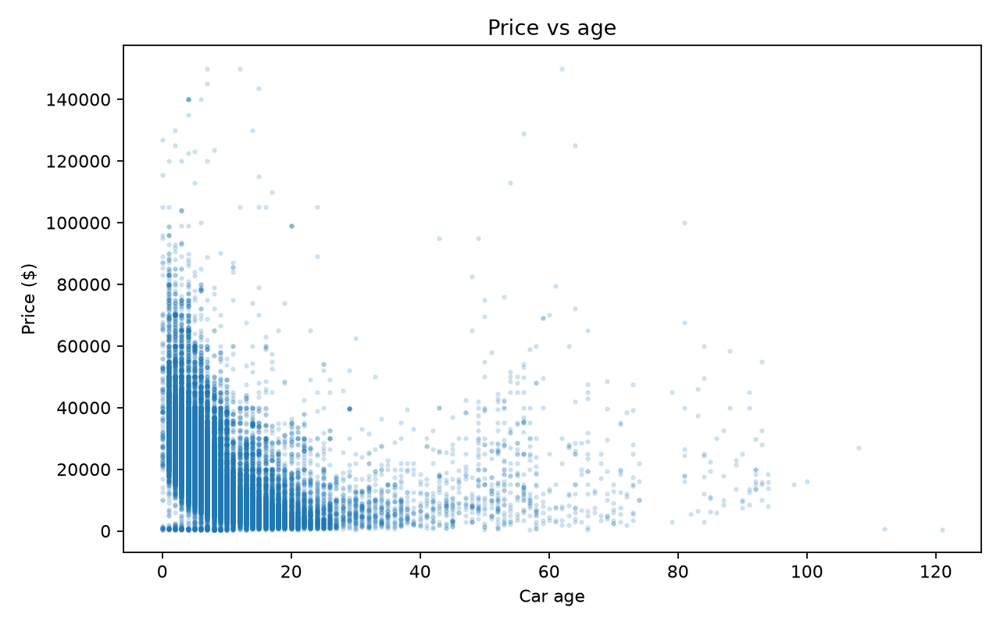
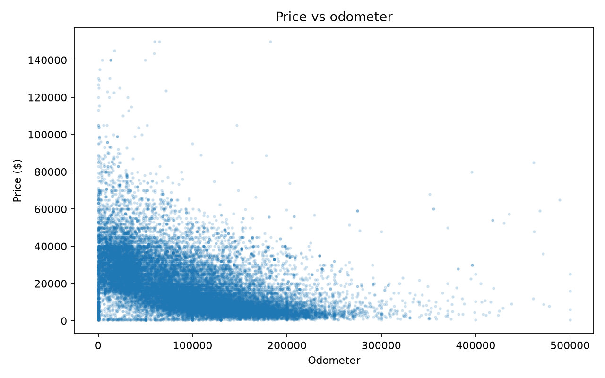
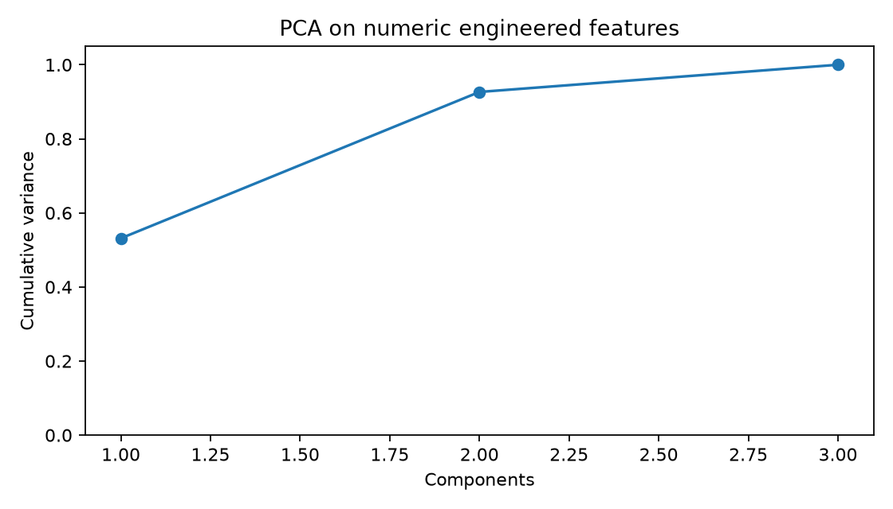
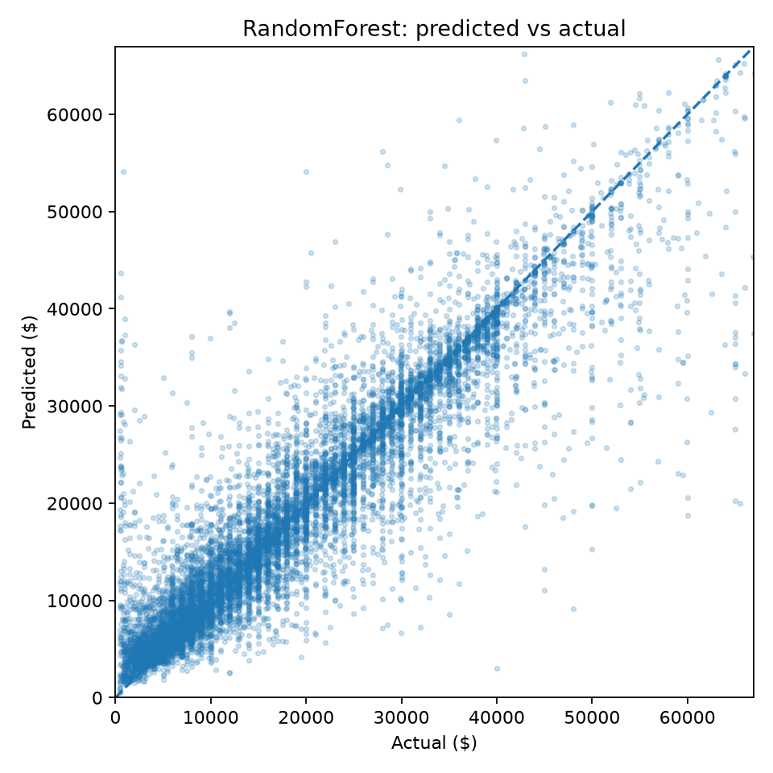
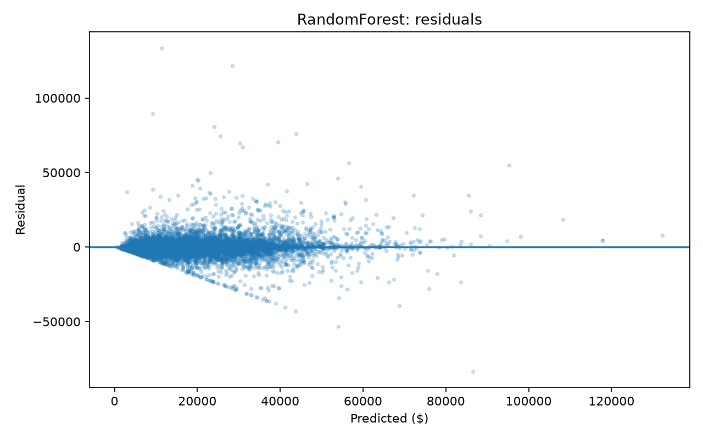
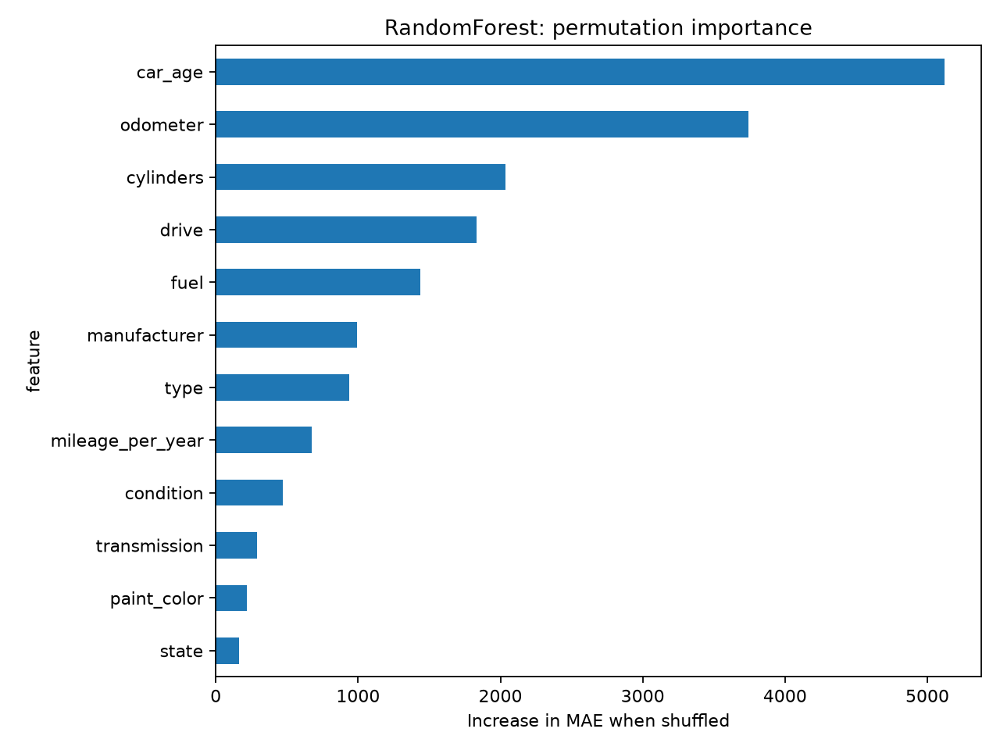
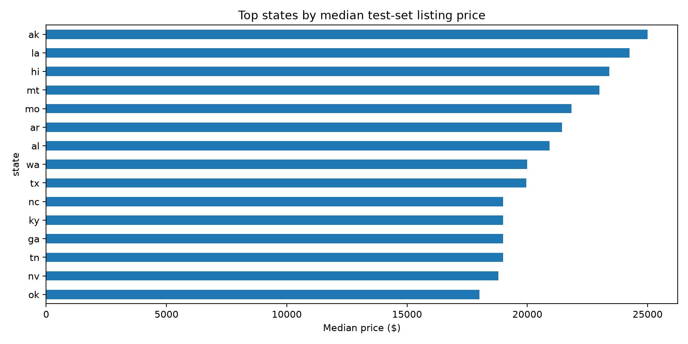

# CSE437 Data Science: Project Report
## Cover
**Project title:** Used Car Price Prediction from Craigslist Listings  

**Course / section / semester:** CSE437 Data Science — _Section:06_

**Group members:**
- **Sangeeta Sarker** — ID: **22201164** — GSuite: **sangeeta.sarker@g.bracu.ac.bd**
- **Prapti Anabil Arnab** — ID: **22299237** — GSuite: **prapti.anabil.arnab@g.bracu.ac.bd**
- **Naveed Shahrear** — ID: **23201187** — GSuite: **naveed.shahrear@g.bracu.ac.bd**

**GitHub repository:** _Paste final GitHub repository link here_

**Date:** _03 September 2026_

---

## Summary
In this project, we predict used-car asking prices using Austin Reese's Craigslist Used Cars Dataset. The dataset contains 426,880 listings with 26 variables. Our target is `price`, which is a continuous variable measured in US dollars. The dataset has a lot of missing information as well as unrealistic values entered by users, which makes it a good example of a real-world data-science problem. After cleaning the data, 384,558 records remained. We then used a reproducible sample of 120,000 rows and split it into 80% training, 10% validation, and 10% test data. We compared a median-price baseline, Ridge Regression, and Random Forest Regressor, using Mean Absolute Error (MAE) as our main evaluation metric. The tuned Random Forest gave the best results on the held-out test set, with an MAE of **$3,247.74**, RMSE of **$6,137.04**, and R² of **0.8286**. Based on permutation importance, car age, odometer mileage, and cylinder count were the three most important predictors. The error analysis also showed that the model had the most difficulty predicting luxury vehicles priced at $50,000 or more.

---

## 1. Problem and Dataset
### 1.1 Problem statement
This is a supervised regression task where the goal is to predict the advertised price of a used vehicle from its characteristics and listing location. Accurate price prediction is useful because used-car asking prices can vary a lot depending on factors such as depreciation, mileage and usage, manufacturer, mechanical configuration, condition, vehicle type, and the local market.

### 1.2 Dataset
**Source:** Austin Reese, **Used Cars Dataset**, Kaggle  

https://www.kaggle.com/datasets/austinreese/craigslist-carstrucks-data

**Collection method:** Craigslist used-vehicle listings scraped across the United States.  

**Original size:** **426,880 rows × 26 columns**  

**File used:** `vehicles.csv`

The raw dataset includes vehicle details, listing information, geographic information, and several free-text or identifier fields. It also contains a considerable amount of missing data and some unrealistic numerical values, so the dataset required cleaning before it could be used for modeling.

### 1.3 Target variable
The target variable is `price`, measured in US dollars. Since price is a continuous numerical value, this is a regression problem. In the raw dataset, the price distribution is extremely right-skewed. The median price is **$13,950**, while the values range from **$0** to approximately **$3.74 billion**. Such unusually large values suggest that some prices were entered incorrectly or used as placeholders.

### 1.4 Three questions
1. Which features, especially age, mileage, and manufacturer/brand, drive used-car prices most strongly?

2. Do regional markets show different pricing patterns?

3. Where does the model fail most — luxury cars, very old cars, or high-mileage cars?

---

## 2. Data Handling and Preprocessing
### 2.1 Data quality audit
The original dataset contained **426,880 rows and 26 columns**. There were no completely identical rows in the original 26-column dataset. However, after selecting the 17 variables used for modeling, we found **39 duplicate records**, which were removed before continuing with the analysis.

Missingness was substantial. Important examples include:

- `county`: 100% missing

- `size`: 71.77% missing

- `cylinders`: 41.62% missing

- `condition`: 40.79% missing

- `VIN`: 37.73% missing

- `drive`: 30.59% missing

- `paint_color`: 30.50% missing

- `type`: 21.75% missing

- `odometer`: 1.03% missing

- `year`: 0.28% missing

The raw numerical audit also showed clear data-quality problems. Odometer readings reached **10,000,000 miles**, while price values reached approximately **$3.74 billion**.

### 2.2 Missing values
For the modeling stage, missing numerical values are replaced with the median, while missing categorical values are placed in a constant `missing` category. These steps are included inside scikit-learn pipelines, so the imputation and other preprocessing parameters are learned only from the training data. This helps prevent information from the validation or test sets from leaking into the training process.

We also removed columns that were not useful for our project, were mostly incomplete, or mainly contained identifiers, URLs, or free text. Instead of trying to heavily impute these fields, we excluded them from the modeling data.

### 2.3 Outliers and impossible values
For this project, listings priced below **$500** or above **$150,000** were considered unrealistic or extreme and were removed from the dataset. This filtering step removed **42,283 rows**.

Odometer readings outside the **0–500,000 mile** range were treated as invalid. Instead of deleting the entire listing, we converted those odometer values to missing so that the rest of the information in those records could still be used. This affected **1,148 values**.

We also checked the vehicle year against a reasonable range based on the listing year. No vehicle-year values needed to be removed in the final run.

| Cleaning step | Result |
|---|---:|
| Original rows | 426,880 |
| Duplicate modeling rows removed | 39 |
| Invalid/extreme price rows removed | 42,283 |
| Invalid odometer values set missing | 1,148 |
| Total rows removed | 42,322 |
| Final cleaned rows | **384,558** |

Approximately **90.09%** of the original observations were retained.

### 2.4 Transformation and scaling
Categorical strings were lowercased, trimmed, and whitespace-normalized.

Vehicle age was calculated relative to the Craigslist listing year:

`car_age = posting_year - year`

A second engineered variable was created:

`mileage_per_year = odometer / (car_age + 1)`

The `+1` avoids division by zero for vehicles listed in their model year.

For Ridge Regression, the numerical variables go through median imputation and standard scaling, while categorical variables are handled with one-hot encoding. Random Forest uses the same imputation and categorical encoding, but numerical scaling is not necessary for tree-based models. Rare or previously unseen categories are handled using:

`OneHotEncoder(handle_unknown='infrequent_if_exist', min_frequency=25)`

### 2.5 Before and after cleaning
### 2.5 Before and after cleaning

| Stage | Rows | Columns | Median price | Odometer missing |
|---|---:|---:|---:|---:|
| Raw selected data | 426,880 | 17 | $13,950 | 1.03% |
| Cleaned data | 384,558 | 19 | $15,900 | 0.85% |

The increase from 17 to 19 columns reflects the addition of the engineered variables `car_age` and `mileage_per_year`.

---

## 3. Statistical Analysis
### 3.1 Descriptive statistics
The raw price distribution was extremely skewed. Before cleaning, the median price was **$13,950**, with Q1 at **$5,900** and Q3 at **$26,485.75**. The mean was much higher, at approximately **$75,199**, because the extreme price values pulled it upward.

For odometer mileage, the raw median was **85,548 miles**, while Q1 was **37,704** and Q3 was **133,542.5**. Some listings reported extremely high odometer readings of up to **10,000,000 miles**, which showed why we needed to apply validity rules before modeling.

Median prices also differed noticeably across manufacturers. For example, the median prices were **$37,990** for Tesla, **$29,950** for Porsche, **$29,995** for RAM, **$17,000** for Ford, **$13,995** for Toyota, **$9,250** for Honda, and **$4,235.50** for Saturn.

### 3.2 Relationships
The exploratory plots show that both vehicle age and total mileage are strongly associated with listed price.

These relationships support using both depreciation-related and usage-related variables in the predictive model.

### 3.3 What the data says so far
- The price distribution is strongly skewed and contains unrealistic extremes.

- Vehicle age and odometer mileage capture different aspects of depreciation and use.

- Manufacturer and vehicle configuration are associated with substantial price differences.

- Regional medians differ, but part of this variation may reflect differences in the types of vehicles listed in each state.

- Identifier, URL, VIN, image, coordinate, and free-text fields were excluded to reduce leakage risk and unnecessary dimensionality.

---

## 4. Feature Engineering
### 4.1 Derived features
Two derived variables were created:

1. ****`car_age`*** — calculated from listing year minus vehicle model year. This is more directly interpretable for depreciation than raw model year.

2. ****`mileage_per_year`*** — odometer divided by `(car_age + 1)`. This captures usage intensity relative to vehicle age.

### 4.2 Dimensionality reduction
PCA was applied to the three standardized numerical engineered variables.

| Component | Explained variance | Cumulative variance |
|---|---:|---:|
| PC1 | 53.14% | 53.14% |
| PC2 | 39.52% | 92.66% |
| PC3 | 7.34% | 100.00% |

The first two principal components explained approximately **92.66%** of the numerical variance.

PCA was demonstrated but **not retained in the final predictive pipeline**. Only three engineered numerical variables were available, while the categorical predictors were important. Retaining the original variables also preserved interpretability for feature importance and error analysis.

### 4.3 Feature selection
Feature selection combined domain screening with permutation-importance ranking from a compact Random Forest validation model.

| Rank | Feature | Importance |

|---:|---|---:|

| 1 | car_age | 4241.21 |

| 2 | odometer | 3682.75 |

| 3 | cylinders | 1915.16 |

| 4 | drive | 1490.86 |

| 5 | fuel | 1277.63 |

| 6 | mileage_per_year | 473.39 |

| 7 | manufacturer | 424.42 |

| 8 | type | 287.10 |

Features with lower individual importance were still retained when they had plausible predictive value and added complementary categorical information.

### 4.4 Final feature set
The final predictors were:

`car_age`, `odometer`, `mileage_per_year`, `manufacturer`, `condition`, `cylinders`, `fuel`, `title_status`, `transmission`, `drive`, `type`, `paint_color`, `state`, and `region`.

Raw `year` was replaced by `car_age`. IDs, URLs, VIN, description, image URL, county, coordinates, and posting timestamp were excluded from final modeling.

---

## 5. Modeling and Validation
### 5.1 Validation strategy
A reproducible modeling sample of **120,000 observations** was used to keep training and tuning practical on a normal laptop.

| Split | Rows | Percentage |

|---|---:|---:|

| Training | 96,000 | 80% |

| Validation | 12,000 | 10% |

| Test | 12,000 | 10% |

Random seed **437** was used. Hyperparameter tuning was conducted using cross-validation on the training data. The held-out test set was evaluated only after model selection.

### 5.2 Baseline
A `DummyRegressor(strategy='median')` was used as a trivial baseline. Any useful learned model should substantially outperform this predictor.

### 5.3 Model families
**Ridge Regression** represents a regularized linear model family. It provides a strong linear baseline after scaling numerical variables and one-hot encoding categorical variables.

**Random Forest Regressor** represents a nonlinear tree-ensemble family. It can capture interactions, thresholds, and nonlinear relationships without requiring a linear relationship between predictors and price.

### 5.4 Metrics
**Primary metric:** Mean Absolute Error (MAE), measured in US dollars.

Secondary metrics:

- Root Mean Squared Error (RMSE)

- R²

- Mean Absolute Percentage Error (MAPE)

MAE was selected as the primary metric before examining results because it is directly interpretable in dollars and is less dominated by extreme residuals than RMSE.

MAPE is reported only as a supplementary measure because percentage error becomes unstable for low-priced vehicles.

---

## 6. Hyperparameter Tuning
### 6.1 Search space
**Ridge GridSearchCV**

`alpha = {0.1, 1, 10, 50, 100}`

**Random Forest RandomizedSearchCV**

- `n_estimators = {80, 120, 180}`

- `max_depth = {None, 12, 20, 30}`

- `min_samples_split = {2, 5, 10}`

- `min_samples_leaf = {1, 2, 4}`

- `max_features = {1.0, sqrt, 0.5}`

### 6.2 Method
Ridge used exhaustive grid search. Random Forest used **10 randomized parameter combinations** with **3-fold cross-validation** and negative MAE scoring.

To keep tuning reproducible on student hardware, the hyperparameter-search sample was capped at **60,000 training observations**. The selected configuration was subsequently refitted using the full modeling training split.

### 6.3 Results
The best Ridge configuration was:

`alpha = 50`

The best Random Forest configuration was:

| Hyperparameter | Best value |

|---|---:|

| n_estimators | 80 |

| max_depth | 30 |

| min_samples_split | 5 |

| min_samples_leaf | 1 |

| max_features | 0.5 |

Validation performance was:

| Model | MAE | RMSE | R² | MAPE |

|---|---:|---:|---:|---:|

| Baseline Median | $11,440.47 | $15,651.60 | -0.0533 | 131.56% |

| Ridge | $6,291.21 | $9,878.35 | 0.5804 | 95.07% |

| Random Forest | **$3,325.52** | **$6,646.26** | **0.8101** | **53.20%** |

The generated files `results/ridge_search.csv` and `results/rf_search.csv` contain the complete search results and allow the trend across candidates to be inspected rather than reporting only the winner.

---

## 7. Results, Visualization and Error Analysis
### 7.1 Test set performance
Final performance on the untouched test set was:

| Model | MAE | RMSE | R² | MAPE |

|---|---:|---:|---:|---:|

| Median baseline | $11,272.80 | $15,211.79 | -0.0529 | 133.47% |

| Ridge Regression | $6,213.53 | $9,609.49 | 0.5798 | 97.25% |

| **Random Forest** | **$3,247.74** | **$6,137.04** | **0.8286** | **50.39%** |

Random Forest was the strongest model. It reduced MAE by approximately **47.7% relative to Ridge Regression** and approximately **71.2% relative to the median baseline**.

Its R² of **0.8286** indicates that the model explains approximately **82.9% of the variation in used-car prices** in the held-out test data.

### 7.2 Visualization

Permutation importance of the final Random Forest model is shown below.

The three most important predictors were:

1. `car_age` — 5122.60

2. `odometer` — 3744.18

3. `cylinders` — 2036.19

Other important variables included `drive`, `fuel`, `manufacturer`, `type`, and `mileage_per_year`.

### 7.3 Error analysis

Model errors were analyzed for the prespecified groups in the proposal.

| Segment | n | MAE |
|---|---:|---:|
| Luxury cars, actual price ≥ $50,000 | 408 | **$12,764.41** |
| Very old cars, age ≥ 25 years | 549 | **$6,740.80** |
| High-mileage cars, odometer ≥ 150,000 | 2,263 | $2,280.83 |
| Other vehicles | 8,823 | $2,942.28 |

The model clearly struggled most with luxury vehicles. Their MAE was almost four times the overall Random Forest MAE. Very old vehicles were the second-most difficult group.

High-mileage vehicles were not the main failure case; their MAE was actually lower than the general `other` segment.

Possible reasons for poorer luxury-vehicle performance include smaller sample size, greater variation in trim and equipment, rarity, collector value, and other characteristics not fully represented in the available Craigslist variables. These explanations are plausible interpretations rather than causal conclusions.

The 20 largest individual prediction errors are saved in `results/worst_predictions.csv` for concrete failure-case inspection.

### 7.4 Answers to the three questions
**Question 1: Which features drive used-car prices most strongly?**

Vehicle age was the most important predictor, followed by odometer mileage and cylinder count. Drivetrain and fuel type also contributed substantially. Manufacturer was important but ranked below several vehicle-use and mechanical characteristics in the final Random Forest.

**Question 2: Do regional markets show different pricing patterns?**

Yes, descriptively. Among states with at least 50 test listings, the spread between the highest and lowest state-level median prices was approximately **$14,449**.

However, `state` and `region` had relatively low permutation importance compared with vehicle age, mileage, and mechanical characteristics. Therefore, geographic price differences should not be interpreted as purely causal regional effects; they may partly reflect differences in the types of vehicles listed in each market.

**Question 3: Where does the model fail most?**

The largest errors occurred for **luxury cars priced at $50,000 or more**, with MAE = **$12,764.41**. Very old cars were the second-most difficult segment, with MAE = **$6,740.80**. High-mileage cars were predicted comparatively well, with MAE = **$2,280.83**.

---

## 8. Limitations and Next Steps
Craigslist prices are asking prices rather than completed-sale prices. Listings may contain user-entry mistakes, reposts, missing characteristics, and unobserved differences in vehicle trim, mechanical condition, optional equipment, accident history, or seller behavior.

The regional analysis is descriptive and does not establish causal effects of location.

A 120,000-row reproducible modeling sample was used instead of fitting every model on all 384,558 cleaned observations. This improves computational practicality but sacrifices some available information.

MAPE is high because it is sensitive to low-priced vehicles and should therefore not be interpreted as the primary performance measure.

Future work could investigate gradient-boosting methods, time-aware validation, geospatial features, richer model/trim information, and carefully processed text from listing descriptions.

---

## 9. Contributions

| Member | Student ID | Contribution |
|---|---|---|
| Naveed Shahrear | 23201187 | Data preprocessing, evaluation, and error analysis |
| Sangeeta Sarker | 22201164 | Feature engineering and PCA |
| Prapti Anabil Arnab | 22299237 | Model development and hyperparameter tuning |

---

## References
- Reese, A. **Used Cars Dataset**. Kaggle. https://www.kaggle.com/datasets/austinreese/craigslist-carstrucks-data

- scikit-learn documentation. https://scikit-learn.org/

- pandas documentation. https://pandas.pydata.org/

- NumPy documentation. https://numpy.org/

- Matplotlib documentation. https://matplotlib.org/
